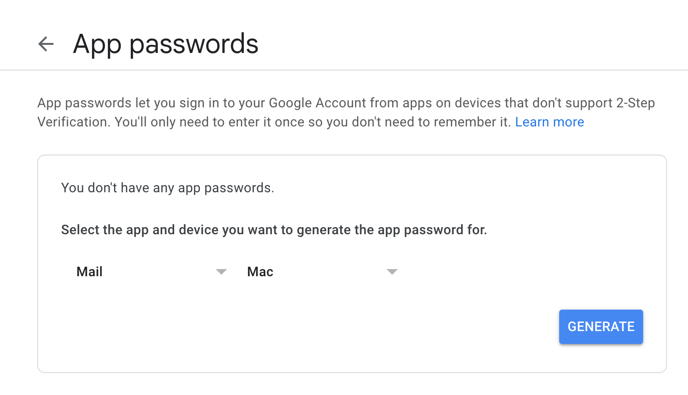
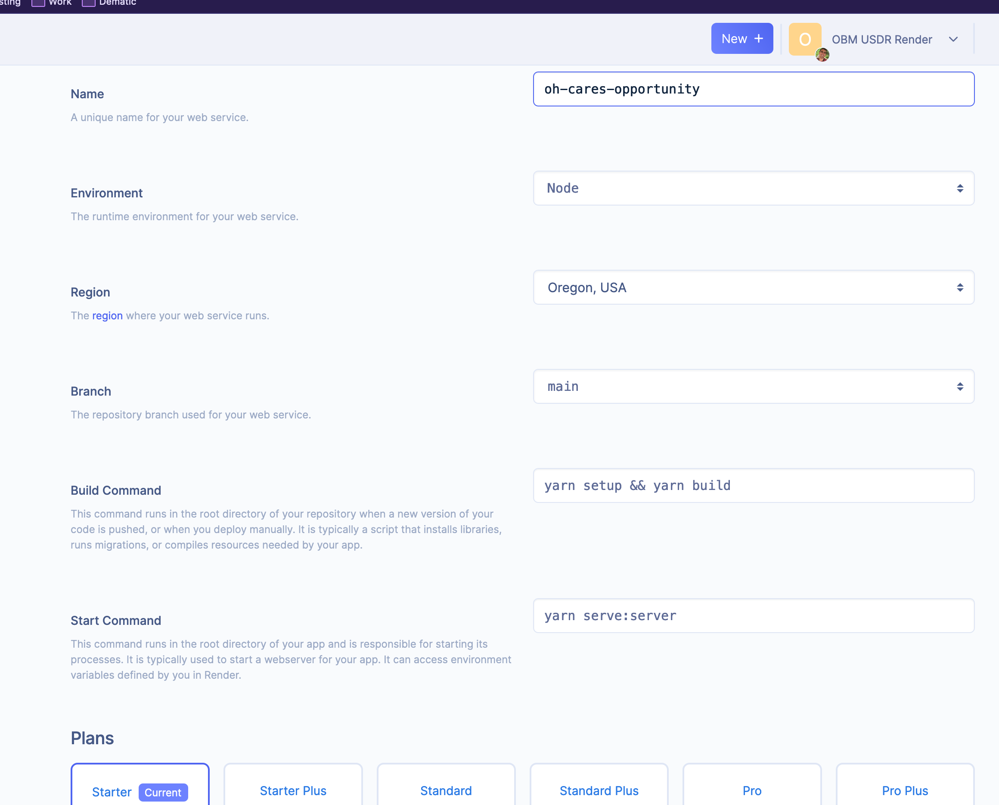
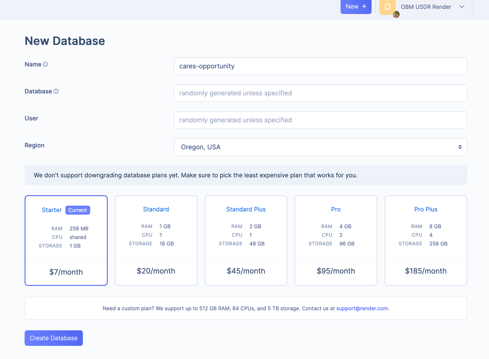

[](./CODE_OF_CONDUCT.md)

# USDR Grant Opportunities

A grant identification tool enabling partners to search for and track available grants.

This application is currently hosted at gost-grants-tools.onrender.com and also at grants.usdigitalresponse.org. Changes made to the main branch will be reflected immediately.

# Project structure

```
├── packages                                    # Yarn workspace
│   ├── client                                  # Vue App
│   └── server                                  # Node server
│       ├── migrations                          # db migrations
│       └── seeds                               # db seeds
│       └── knexfile                            # knex configuration
```

Each folder inside packages/ is considered a workspace. To see a list of all worskpaces, run the following

`yarn workspaces info`

# Setup

1. Ensure using NODE Version 14 (v14.19.0)

First, check the [`.nvmrc` file](./.nvmrc) to make sure you have the correct version of Node.js installed. If you are using [Nodenv](https://github.com/nodenv/nodenv) or [NVM](https://nvm.sh/), it should pick up on the correct version.

To setup your workspace run the following commands at the root of the project

1.1 (optional) Setup nvm

```
> brew install nvm
> vim ~/.zshrc
add the follow lines to your .zshrc file
  export NVM_DIR="$HOME/.nvm"
  source "$NVM_DIR/nvm.sh"
> esc
> :wq
```

***Make sure to use new terminals once modified `~/.zshrc`***


```
> nvm install v14.19.0
> nvm use v14.19.0
```

2. Install dependencies

The scripts will install yarn and download npm dependencies for all yarn workspaces.

```
> cd usdr-gost/
> npm i yarn@^1.22.4 -g
> yarn run setup
```

3. Create database called usdr_grants.
   Install postgres DB. I personally used https://postgresapp.com/

```
> psql -h localhost -p 5432
> CREATE DATABASE usdr_grants;
> CREATE DATABASE usdr_grants_test;
```

4. Setup ENVs

Rename packages/client & packages/server `.env.example` to `.env` and
Update packages/client & server `.env`

```
> cd packages/client && export $(cat .env)
> cd packages/server && export $(cat .env)
```

Create .env file in server workspace based on the .env.example. See Deployment section for more information on the .env file. Also create .env file in client workspace based on the .env.example file.

Set environment variable pointing to local postgres DB, this is used for migrations (knex does not load .env file)

`export POSTGRES_URL=postgresql://localhost:5432/usdr_grants` (individual vars) or `export $(cat .env)` (whole file)

**_Note:_** In order to login, the server must be able to send email. Set the relevant `NODEMAILER_HOST`, `NODEMAILER_PORT`, `NODEMAILER_EMAIL`, `NODEMAILER_EMAIL_PW` environment variables in .env to credentials for a personal email account (e.g. for Gmail, see [here](https://support.google.com/mail/answer/7126229)).


If running into `Error: Invalid login: 535-5.7.8 Username and Password not accepted.` then ["Allow Less Secure Apps"](https://myaccount.google.com/lesssecureapps) - [source](https://stackoverflow.com/a/59194512)

**NOTE:** Much more reliable and preferable to go the App Password route (see step 7)

5. Run DB Migrations & Seed

In server workspace, run migrations:

**_NOTE:_** In `server/seeds/dev/index.js`, update the adminList by replacing `CHANGEME@GMAIL.COM` with your email **_to be able to login to the system_**.
Then run seeds:

```
> cd packages/server
> export $(cat .env) (delete all comments in .env file)
> yarn db:migrate
> yarn db:seed
```

6. Run Server (Terminal 1)

After that you should be able to serve the backend and frontend by running in both server and client folders.

**_Ensure using node v14_**

```
> nvm use v14.19.0
> cd packages/server
> yarn serve
```

6.1 Run Client (Terminal 2)

After that you should be able to serve the backend and frontend by running in both server and client folders.

**_*Ensure using node v14*_**

```
> nvm use v14.19.0
> cd packages/client
> yarn serve
```

**NOTE:** need to run `> unset AWS_ACCESS_KEY_ID` if `> echo $AWS_ACCESS_KEY_ID` returns a result else will run into the error below. The application will try to use AWS Simple Email Service (SES) if `AWS_ACCESS_KEY_ID` is found as an env var


7. Visit `client_url/login` (e.g http://localhost:8080/#/login) and login w/ user set in Step 5.

**NOTE:** if you only see a blank screen then ensure you've set the `packages/client/.env` up

**NOTE:** if you get `Error: Invalid login: 534-5.7.9 Application-specific password required.` then you'll need to set an App Password (https://myaccount.google.com/u/0/apppasswords) replacing your `NODEMAILER_EMAIL_PW` with the new generated PW.




8. When you get the login email link, change the redirected path from `localhost:3000/api/sessions/...` to your client_url e.g `localhost:8080/api/sessions/`


# Additional Info:

## Yarn Workspaces

Workspaces optimizes our repo by hoisting all of our separate node_modules/ to the root level meaning that a single yarn install command installs the NPM modules for all services

https://classic.yarnpkg.com/en/docs/workspaces/

## Lerna

Lerna helps us manage our packages, publish them, and keeps track of the dependencies between them. For example, it is used to run linting, deploy, and test scripts for each package from the root of the project.

Example usages

`npx lerna bootstrap` - recursive yarn install

`npx lerna run --scope server --stream start`

## Adding dependencies

### To add dependencies to one workspace

`npx lerna add {modules} --scope="{workspace_name}"` - where workspace_name is the name in package.json. Run `yarn workspaces info` to see a list of packages

    Example `npx lerna add uuid --scope="server" --dev`

Or you can run yarn inside the workspace

`yarn add {modules}`

### Add dependencies to multiple packages

`npx lerna add {modules}`

NOTE: yarn complains about incompatibility of some node modules with our node version. When using yarn, pass `--ignore-engines` when doing `yarn add/remove`. I have not been able to pass this argument when running `npx lerna add..`. After running lerna do a `yarn run bootstrap` at the root of the project to get your dependency correctly installed.

## Linting

### VSCode

Install Vue plugin: `jcbuisson.vue`, `Vue.volar`

Install Vue Dev Tools: https://chrome.google.com/webstore/detail/vuejs-devtools/nhdogjmejiglipccpnnnanhbledajbpd?hl=en

Install the eslint plugin https://marketplace.visualstudio.com/items?itemName=dbaeumer.vscode-eslint

After that you should be able to see eslint prompts in js files

For linting on auto save:

- Go to VSCode settings
  - Shift + Command + P
  - Search for settings
  - Select "Open Settings (JSON)"
- Paste the following snippet

```
"editor.formatOnSaveMode": "modifications",
  "editor.formatOnSave": true,
  "editor.codeActionsOnSave": {
    "source.fixAll.eslint": true
}
```

Note: Before Pasting check if there are any conflicting settings regarding esling or formatOnSave

Sharing my complete VSCode Setting

```
{
  "terminal.integrated.shell.osx": "/bin/zsh",
  "azureFunctions.showProjectWarning": false,
  "window.zoomLevel": 0,
  "diffEditor.ignoreTrimWhitespace": false,
  "azureFunctions.showCoreToolsWarning": false,
  "editor.columnSelection": false,
  "editor.find.cursorMoveOnType": true,
  "editor.formatOnSaveMode": "modifications",
  "editor.formatOnSave": true,
  "editor.codeActionsOnSave": {
    "source.fixAll.eslint": true
  }
}
```

### IntelliJ

After installing depedencies, IntelliJ should start using eslint automatically:

> By default, IntelliJ IDEA marks the detected errors and warnings based on the severity levels from the ESLint configuration
> https://www.jetbrains.com/help/idea/eslint.html#ws_js_linters_eslint_install

# Deployment

## Render

1. Create web service



2. Create database



3. Update web service environment variables


```
POSTGRES_URL=<POSTGRE_CONNECTION_STRING> # Render Internal connection string ie postgres://cares_opportunity_user:<pass>@<domain>/cares_opportunity_1e53

COOKIE_SECRET=<RANDOM_ALPHANUMERIC_SECRET>

API_DOMAIN=<WEB_SERVICE_URL> # Render web service url ie. https://cares-grant-opportunities-qi8i.onrender.com
VUE_APP_GRANTS_API_URL=<WEB_SERVICE_URL> # ie. https://cares-grant-opportunities-qi8i.onrender.com

STATE_NAME=Nevada
NODE_ENV=development or production or test

NOTIFICATIONS_EMAIL="grants-identification@usdigitalresponse.org"
SES_REGION="us-east-1"
AWS_ACCESS_KEY_ID=<AWS_ACCESS_KEY_ID>
AWS_SECRET_ACCESS_KEY=<AWS_SECRET_ACCESS_KEY>

ENABLE_GRANTS_SCRAPER=true
GRANTS_SCRAPER_DATE_RANGE=7 # date range of grants that will be scraped
GRANTS_SCRAPER_DELAY=1000 # delay in milliseconds for scraper

NODE_OPTIONS=--max_old_space_size=1024 # increase node max memory, had problems with node not using all of renders server memory. This will depend on the plan
```

## DB Migrations

1. Get the postgres external connection string from render. Set it as an environment variable

`export POSTGRES_URL="postgres://user:{pass}@{domain}/{db}?ssl=true"`

NOTE: must add `?ssl=true`

2. Change directory to packages/server

3. Update seeds/dev files accordingly
   - seeds/dev/ref/agencies.js - list of agencies to be created. You can update this with the state provided agency. Note: We add a special USDR agency for our accounts in the system
   - seeds/dev/index.js - Update the admin list variable accordingly
4. Run the following commands

```
npx knex migrate:latest
npx knex seed:run
```

After that you should be able to access the site and login with the users set in the migration.

## Code of Conduct

This repository falls under [U.S. Digital Response’s Code of Conduct](./CODE_OF_CONDUCT.md), and we will hold all participants in issues, pull requests, discussions, and other spaces related to this project to that Code of Conduct. Please see [CODE_OF_CONDUCT.md](./CODE_OF_CONDUCT.md) for the full code.

## Contributing

This project wouldn’t exist without the hard work of many people. Thanks to the following for all their contributions! Please see [`CONTRIBUTING.md`](./CONTRIBUTING.md) to find out how you can help.

**Lead Maintainer:** [Rafael Pol (@Rapol)](https://github.com/Rapol)

## License & Copyright

Copyright (C) 2020-2021 U.S. Digital Response (USDR)

Licensed under the Apache License, Version 2.0 (the "License"); you may not use this software except in compliance with the License. You may obtain a copy of the License at:

[`LICENSE`](./LICENSE) in this repository or http://www.apache.org/licenses/LICENSE-2.0

Unless required by applicable law or agreed to in writing, software distributed under the License is distributed on an "AS IS" BASIS, WITHOUT WARRANTIES OR CONDITIONS OF ANY KIND, either express or implied. See the License for the specific language governing permissions and limitations under the License.
